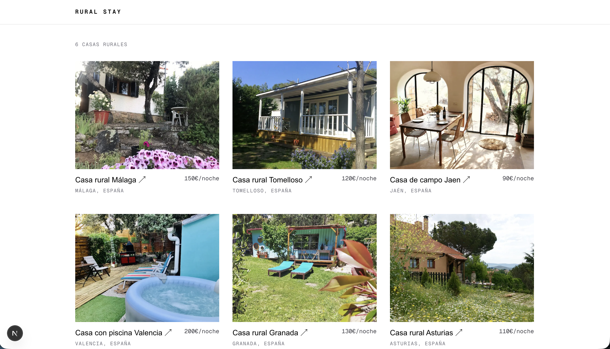
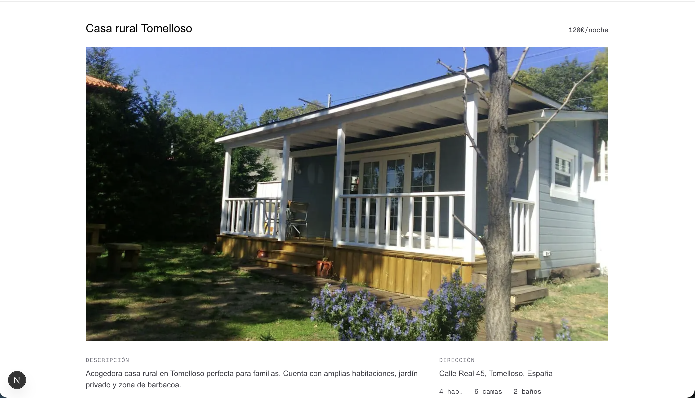

# Casas Rurales — Next.js

Rural house rental listing built with Next.js for the MetaFrameworks lab. Two screens: house listing and house detail, both pulling from the mock API server provided on the exercise.

## Demo

| Listing                                | Detail                                       |
| -------------------------------------- | -------------------------------------------- |
|  |  |

## Stack

- Next.js 16 + TypeScript
- Tailwind CSS v4
- Mock API: [master-frontend-metaframeworks-lab](https://github.com/Lemoncode/master-frontend-metaframeworks-lab) (Hono server, port 3001)

## Decisions

| Area               | Choice                                                                                                                 | Why                                                                                                                                                                                                        |
| ------------------ | ---------------------------------------------------------------------------------------------------------------------- | ---------------------------------------------------------------------------------------------------------------------------------------------------------------------------------------------------------- |
| Rendering listing  | ISR, `revalidate: 3600`                                                                                                | Data doesn't change often, but shouldn't be frozen forever like pure SSG                                                                                                                                   |
| Rendering detail   | SSG via `generateStaticParams`                                                                                         | Small, fixed set of houses — pre-render all of them at build time instead of fetching on every request                                                                                                     |
| Rendering at scale | Would switch to a popular subset + `dynamicParams` for detail, real pagination + on-demand `revalidateTag` for listing | Pre-rendering thousands of rarely-visited pages blows up build time; a blind timer doesn't reflect real data changes                                                                                       |
| Routing            | App Router over Pages Router                                                                                           | Current recommended approach; each route picks its own rendering strategy with no extra config                                                                                                             |
| Folder structure   | Layer-based (`app/`, `components/`, `lib/`) over feature-based                                                         | Single domain (houses) — splitting by feature would just add depth with no benefit                                                                                                                         |
| Data shaping       | API → ViewModel mappers (`lib/mappers.ts`)                                                                             | Maps the raw `House` shape into view-specific shapes (`HouseCardVM`, `HouseDetailVM`) with already-formatted strings (price, location, image URL) — keeps formatting out of JSX and decoupled from the API |
| Env vars           | Separate `API_URL` (server-only) and `NEXT_PUBLIC_API_URL` (client-visible)                                            | Same host today, but different concerns — private data fetching vs. public image URLs resolvable from the client bundle                                                                                    |
| Images             | `next/image` + `remotePatterns` + `dangerouslyAllowLocalIP`                                                            | Needed to allow/optimize images from the mock server's `localhost:3001` host                                                                                                                               |

## What's implemented

- House listing (`/`) with cards (image, name, location, price)
- House detail (`/houses/[id]`) with description, address, room/bed/bath counts, and reviews
- Navigation between both screens
- Proper 404 handling for non-existent house IDs
- Optimized images via `next/image`

Not implemented (optional in the assignment): search/filter, booking button.

## Running locally

1. Start the mock API server (from the cloned `master-frontend-metaframeworks-lab/api-server` repo):

   ```
   npm install
   npm start
   ```

   Runs on `http://localhost:3001`.

2. In this project, create `.env.local`:

   ```
   API_URL=http://localhost:3001
   NEXT_PUBLIC_API_URL=http://localhost:3001
   ```

3. Install and run:

   ```
   npm install
   npm run dev
   ```

   Open `http://localhost:3000`.
